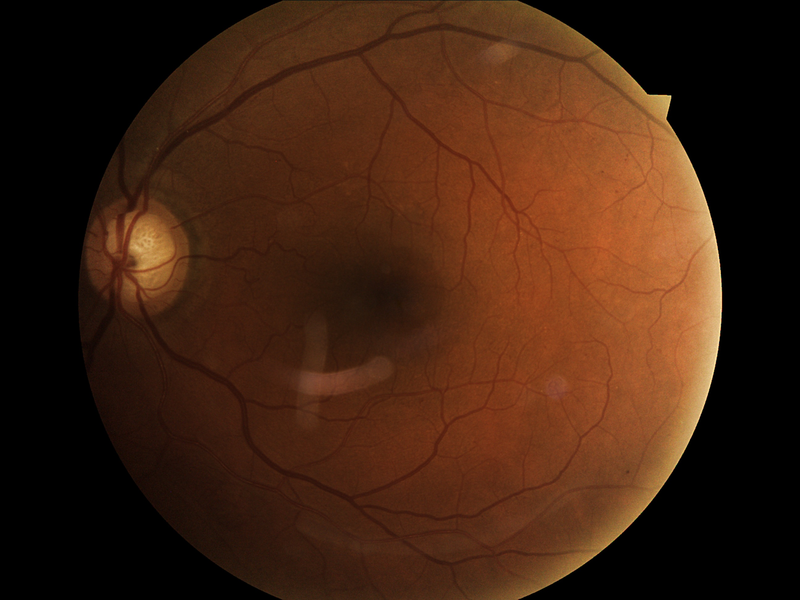
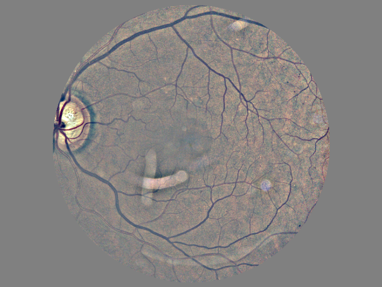
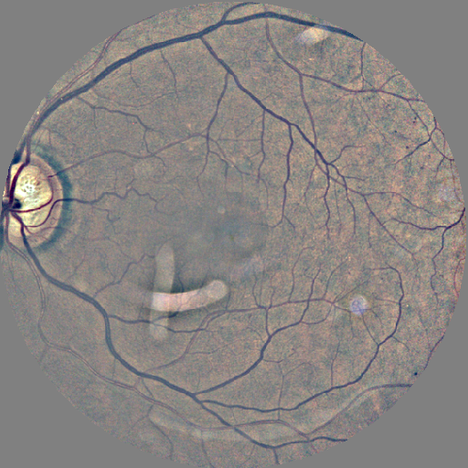

# Requirements

Python2, and see `freezefile.txt`

```
pip install -r  freezefile.txt 
```


# Usage

Crop the outer 10% to get a fully circular image and normalize
```
python scale_and_normalize.py -i example/16031_left_800.png -o example/16031_left_800_sn.png
```

Crop the outer area, leaving only the round color fundus image
```
python convert_single_img.py --input_path example/16031_left_800_sn_preproc-kaggledr.png --output_path example/16031_left_800_sn_preproc-kaggledr_crop.png
```


# Example

Original image:



After step 1:



After step 2:


